# IsaacLab Parkour

```mermaid
graph LR
    %% ==========================================
    %% 样式定义
    %% ==========================================
    classDef inputs fill:#E1F5FE,stroke:#01579B,stroke-width:2px,rx:5,ry:5;
    classDef encoders fill:#FFF3E0,stroke:#E65100,stroke-width:2px,rx:5,ry:5;
    classDef latent fill:#F3E5F5,stroke:#4A148C,stroke-width:1px,stroke-dasharray: 5 5;
    classDef actor fill:#E8F5E9,stroke:#1B5E20,stroke-width:2px,rx:5,ry:5;
    classDef loss fill:#FFEBEE,stroke:#B71C1C,stroke-width:2px,stroke-dasharray: 5 5;
    classDef output fill:#FFF,stroke:#333,stroke-width:2px;

    %% ==========================================
    %% 输入层 (垂直堆叠)
    %% ==========================================
    subgraph Inputs ["Observation Space"]
        OBS_P("Proprioception<br/>53-dim"):::inputs
        OBS_S("Height Scan<br/>132-dim"):::inputs
        OBS_Priv("Privileged Info<br/>Exp:9 / Imp:29 / H:8"):::inputs
        OBS_Hist("History Buffer<br/>10x53 = 530-dim"):::inputs
        OBS_Depth("Depth Images<br/>2 x 58 x 87"):::inputs
        
        %% 使用隐式连接强制垂直排列 (适配旧版本)
        OBS_P ~~~ OBS_S ~~~ OBS_Priv ~~~ OBS_Hist ~~~ OBS_Depth
    end

    %% ==========================================
    %% 编码层 (垂直堆叠)
    %% ==========================================
    subgraph Encoders ["Encoders & Backbones"]
        ENC_Scan("Scan Encoder<br/>MLP: 132->32"):::encoders
        ENC_Priv("Privileged Encoder<br/>MLP: 29->20"):::encoders
        ENC_Hist("History Encoder<br/>1D Conv"):::encoders
        ENC_Est("Estimator<br/>Reconstruct Priv"):::encoders
        ENC_Depth("Depth Backbone<br/>CNN + GRU"):::encoders

        %% 使用隐式连接强制垂直排列
        ENC_Scan ~~~ ENC_Priv ~~~ ENC_Hist ~~~ ENC_Est ~~~ ENC_Depth
    end

    %% ==========================================
    %% 策略网络
    %% ==========================================
    subgraph Policy ["Gated Dual-Head Actor"]
        Input_Concat(("Concat")):::latent
        Gate("Gating Network<br/>Input: Hurdles"):::actor
        Head_Jump("Head 1: Jump"):::actor
        Head_Crawl("Head 2: Crawl"):::actor
        Mixer(("Soft Select")):::output
        Action_Out("Joint Targets<br/>12-dim"):::output
        
        %% 布局辅助
        Input_Concat ~~~ Gate
    end

    %% ==========================================
    %% 连接关系 - 教师流
    %% ==========================================
    OBS_S --> ENC_Scan
    OBS_Priv --> ENC_Priv
    OBS_Hist --> ENC_Hist
    OBS_P --> ENC_Est
    
    ENC_Scan --> Input_Concat
    ENC_Priv --"Train: Priv Latent"--> Input_Concat
    ENC_Hist --"Eval: Hist Latent"--> Input_Concat
    OBS_P --> Input_Concat
    
    %% Actor 内部流
    Input_Concat --> Head_Jump
    Input_Concat --> Head_Crawl
    OBS_Priv --"Hurdle Info"--> Gate
    Gate --> Mixer
    Head_Jump --> Mixer
    Head_Crawl --> Mixer
    Mixer --> Action_Out

    %% ==========================================
    %% 连接关系 - 学生流
    %% ==========================================
    OBS_Depth --> ENC_Depth
    OBS_P --> ENC_Depth
    
    ENC_Depth --"Student Latent"--> Input_Concat
    ENC_Depth --"Yaw Residual"--> OBS_P
    
    %% ==========================================
    %% 损失函数
    %% ==========================================
    subgraph Training ["Loss Functions"]
        LOSS_PPO("Teacher PPO Loss"):::loss
        LOSS_DAgger("DAgger Loss"):::loss
        LOSS_Est("Estimator Loss"):::loss
        LOSS_Distill("Distillation Loss"):::loss
        
        LOSS_PPO ~~~ LOSS_DAgger ~~~ LOSS_Est ~~~ LOSS_Distill
    end

    %% Loss 连接
    Action_Out -.-> LOSS_PPO
    ENC_Priv -.-> LOSS_DAgger
    ENC_Hist -.-> LOSS_DAgger
    ENC_Est -.-> LOSS_Est
    
    %% 学生蒸馏连接
    Action_Out --"Teacher Labels"--> LOSS_Distill
    ENC_Depth -.-> LOSS_Distill
```




基于 Isaac Lab 的栏杆跑酷强化学习项目，覆盖 Galileo/Go2 等机器人在跳跃、钻爬和混合课程下的训练、评估与部署。

## 安装
```bash
cd IsaacLab
git clone https://github.com/CAI23sbP/Isaaclab_Parkour.git
cd Isaaclab_Parkour
pip install -e .

cd parkour_tasks
pip install --no-build-isolation -e .
# 遇到旧版本残留，可先卸载再装：
# pip uninstall -y parkour_tasks && pip install --no-build-isolation -e .
```

## 清理缓存
```bash
find . -name "*.pyc" -delete
find . -name "__pycache__" -delete
```

## 训练与评估
### 环境准备
```bash
conda activate isaaclab
cd /home/lz/Project/IsaacLab/Isaaclab_Parkour
```

### 单机单卡示例（Galileo）
```bash
LOG_RUN_NAME=galileo_teacher python scripts/rsl_rl/train.py \
  --task Isaac-Galileo-Parkour-Teacher-v0 \
  --num_envs 8192 --max_iterations 50000 --run_name auto --headless

LOG_RUN_NAME=galileo_student python scripts/rsl_rl/train.py \
  --task Isaac-Galileo-Parkour-Student-v0 \
  --num_envs 4096 --max_iterations 50000 --run_name auto --headless
```

### 多卡分布式（4 卡示例）
```bash
# 环境
cd IsaacLab/Isaaclab_Parkour/

conda activate isaaclab

# 可选：清理残留
fuser -k -9 /dev/nvidia0 /dev/nvidia1 /dev/nvidia2 /dev/nvidia3

# 安全模式变量（适配 IOMMU/带宽受限机型）
export NCCL_P2P_DISABLE=1
export NCCL_IB_DISABLE=1
export NCCL_SHM_DISABLE=1
export NCCL_SOCKET_IFNAME=ens3f3
export NCCL_ALGO=Ring
export NCCL_PROTO=Simple
export NCCL_MIN_NCHANNELS=1
export TORCH_NCCL_ASYNC_ERROR_HANDLING=1
export OMP_NUM_THREADS=1

CUDA_VISIBLE_DEVICES=0,1,2,3 torchrun --nproc_per_node=4 scripts/rsl_rl/train.py \
  --task Isaac-Galileo-Parkour-Teacher-v0 \
  --distributed --num_envs 3500 --max_iterations 50000 \
  --run_name galileo-teacher --device cuda:0

```
- `LOG_RUN_NAME` 决定日志目录名：`logs/rsl_rl/<exp>/<LOG_RUN_NAME>_<run_name>`。
- `--num_envs` 为每卡环境数，按显存调整。
- 查看可用环境：`python list_envs.py`。

### 可视化 / 评估 / 部署命令

**Play（可视化回放）**

使用 `--checkpoint` 参数指定要加载的模型文件（`*.pt`），支持相对路径或绝对路径。

```bash
# Galileo 教师模型
python scripts/rsl_rl/play.py \
  --task Isaac-Galileo-Parkour-Teacher-Play-v0 \
  --num_envs 16 \
  --checkpoint logs/rsl_rl/unitree_go2_parkour/galileo_teacher_auto/model_4400.pt
  --enable_cameras

# Galileo 学生模型
python scripts/rsl_rl/play.py \
  --task Isaac-Galileo-Parkour-Student-Play-v0 \
  --num_envs 16 \
  --checkpoint logs/rsl_rl/unitree_go2_parkour/galileo_teacher_auto/model_4400.pt
  --enable_cameras

```

**参数说明：**
- `--checkpoint`：指定要加载的模型文件路径（`*.pt`），必须包含完整的文件名（如 `ckpt_50000.pt`）
- `--task`：任务环境名称，**必须使用对应的 Play 版本**（以 `-Play-v0` 结尾）
  - 训练时使用：`Isaac-Galileo-Parkour-Teacher-v0`
  - Play 时使用：`Isaac-Galileo-Parkour-Teacher-Play-v0`
  - **注意**：虽然 task 名称不同，但只要训练和 Play 版本使用相同的 RL 配置（如 `UnitreeGo2ParkourTeacherPPORunnerCfg`），模型就可以兼容加载。Play 版本主要调整了环境配置（可视化、固定地形布局等），但模型结构相同。
- `--num_envs`：并行环境数量，建议设置为 16 或更少以提升性能
- `--enable_cameras`：启用相机传感器（可选，用于可视化）
- 不指定 `--checkpoint` 则使用未训练的随机权重

**环境重置条件说明：**
机器人会在以下情况下被重置（定义在 `parkour_isaaclab/envs/mdp/terminations.py`）：
1. **正常完成**：到达所有目标点（默认 8 个目标点）
2. **时间超时**：超过最大 episode 长度（Play 版本为 60 秒）
3. **摔倒**：机器人翻滚角度过大（roll 或 pitch > 1.5 弧度，约 86 度）
4. **掉落**：机器人高度 < -0.25 米

如果某些机器人提前重置，通常是摔倒或掉落导致的。可以通过调整终止条件阈值来修改这些行为。

**评估**
```bash
python scripts/rsl_rl/evaluation.py \
  --task Isaac-Galileo-Parkour-Teacher-Play-v0 \
  --num_envs 16 \
  --checkpoint logs/rsl_rl/<exp>/<run>/checkpoints/ckpt_50000.pt
```

**部署 demo**
```bash
python scripts/rsl_rl/demo.py \
  --task Isaac-Galileo-Parkour-Teacher-Play-v0 \
  --num_envs 8 \
  --checkpoint logs/rsl_rl/<exp>/<run>/checkpoints/ckpt_50000.pt \
  --enable_cameras
```

常见环境 ID：  
- 教师：`Isaac-Galileo-Parkour-Teacher-v0` / `...-Teacher-Play-v0`  
- 学生：`Isaac-Galileo-Parkour-Student-v0` / `...-Student-Play-v0`  
- Go2 任务同名替换即可。

### TensorBoard
```bash
tensorboard --logdir logs --port 6006
```

## Isaac Sim 视口常用操作
- Tab 返回 viewport；Alt+LMB 旋转，Alt+MMB 平移，Alt+RMB/滚轮 缩放。
- 可选自由相机（Orbit/Fly），F 聚焦选中物体后再导航。
- GUI 运行时按 Space 暂停/继续，方便调整视角；`--enable_cameras` 保持传感器工作。

## 多卡故障速查
- NCCL 非法访存/卡死：保持上面的“安全模式”环境变量，必要时再加 `export CUDA_LAUNCH_BLOCKING=1` 获取堆栈。
- 若仍不稳定：减小 `--num_envs` 或先用对称带宽的卡组；长期方案是关闭 BIOS IOMMU/VT-d 恢复 P2P，并移除禁用变量以提升吞吐。

## 仿真到部署进度
- [x] 教师/学生训练代码开放
- [x] Isaac Lab 内部署 demo（`scripts/rsl_rl/demo.py`）
- [x] 仿真到仿真（MuJoCo）迁移示例
- [ ] 仿真到现实（计划中）

## 许可与引用

若在研究中使用，请引用：
```
@article{cheng2023parkour,
  title={Extreme Parkour with Legged Robots},
  author={Cheng, Xuxin and Shi, Kexin and Agarwal, Ananye and Pathak, Deepak},
  journal={arXiv preprint arXiv:2309.14341},
  year={2023}
}
@article{mittal2023orbit,
  author={Mittal, Mayank and Yu, Calvin and Yu, Qinxi and Liu, Jingzhou and Rudin, Nikita and Hoeller, David and Yuan, Jia Lin and Singh, Ritvik and Guo, Yunrong and Mazhar, Hammad and Mandlekar, Ajay and Babich, Buck and State, Gavriel and Hutter, Marco and Garg, Animesh},
  journal={IEEE Robotics and Automation Letters},
  title={Orbit: A Unified Simulation Framework for Interactive Robot Learning Environments},
  year={2023},
  volume={8}, number={6}, pages={3740-3747},
  doi={10.1109/LRA.2023.3270034}
}
```

仓库引用：`https://github.com/CAI23sbP/Isaaclab_Parkour`

## 联系
`sbp0783@hanyang.ac.kr`
